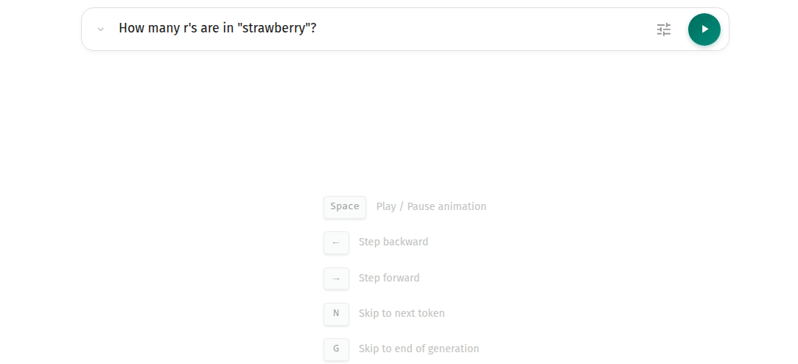

<div align="center">
  

  <h1>AnimatedLLM</h1>

  <p>
    <strong>Understand the mechanics of LLMs.</strong>
  </p>

  <p>
    <a href="https://opensource.org/licenses/MIT">
      
    </a>
    <a href="http://makeapullrequest.com">
      
    </a>
    <a href="https://animatedllm.com">
      
    </a>
    <a href="#">
      
    </a>
  </p>

  <br />

  
</div>

<br />

## 🎓 What is this?

An educational web application designed to teach the mechanics of large language models (LLMs work.

Instead of static diagrams or abstract equations, it provides a dynamic, step-by-step visualization of the Transformer architecture in action.

The application runs **entirely in your browser** using pre-computed data.

👉 **Try it yourself at** **[animatedllm.com](https://animatedllm.com)**

We built this for:

- **Students** who want to build intuition for NLP concepts.
- **Educators** looking for visual aids to explain attention mechanisms and token generation.
- **Curious minds** who want to peek under the hood of modern AI.

## ⌨️ Controls

Navigate the animation using your keyboard:

| Key       | Action                    |
| :-------- | :------------------------ |
| `Space`   | Play / Pause animation    |
| `→` / `←` | Step forward / backward   |
| `N`       | Skip to next token        |
| `G`       | Skip to end of generation |
| `R`       | Reset animation           |
| `T`       | Toggle theme (Light/Dark) |
| `L`       | Switch language           |
| `H`       | Show shortcuts help       |

## 🚀 Running locally

You can also run the app locally in just a few minutes. You will need [Node.js](https://nodejs.org/) (version 20.9.0 or higher) and npm installed.

1. **Install dependencies:**

   ```bash
   npm install
   ```

2. **Start the development server:**
   ```bash
   npm run dev
   ```

## 📚 Cite Us

If you use AnimatedLLM in your research or teaching, please cite our paper: link TBA.
